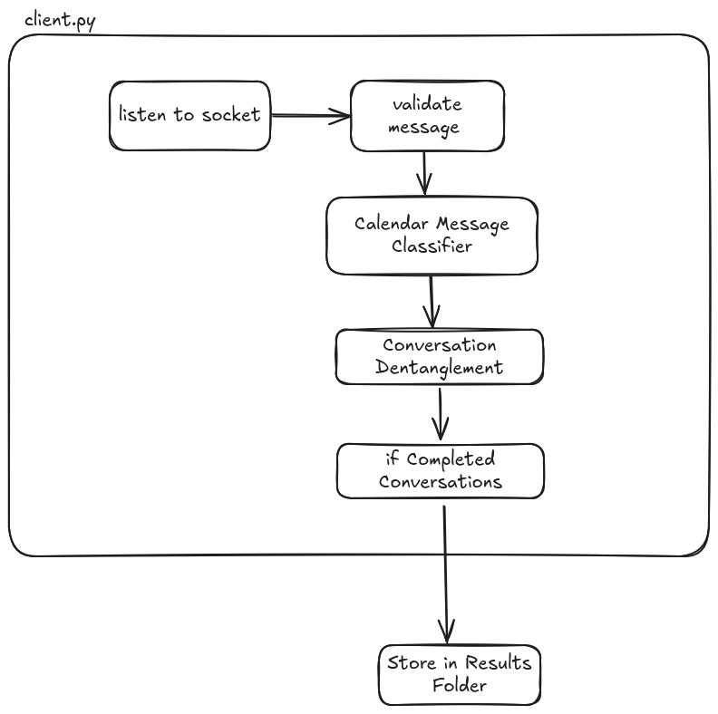

# Message Stream Classifier

A websocket client that processes messages from a socket and tries to dentable conversations and categorize them as possible calendar events

# High level Information flow

# Running With Docker

- setup `.env` file with `cp .env.example .env` and set the WS_SOCK variable, this is the websocket that gets ingested.
- setup docker if you don't have it yet
- run `sh build_and_run.sh`
    - **what it does**
        - creates model (this is where the model gets stored) and results (the output will be generated here) folder
        - it checks if you have the model files if not downloads them
        - run docker build 
        - run docker run command with the required attached volumes
        - execute the client.py in docker, this will start processing the stream

# Running with manual setup / seeting up for development
- setup the `.env` file with the WS_SOCK variable
- setup uv https://docs.astral.sh/uv/getting-started/installation/ 
- create `model/bert_classifier_v1` and `results` folder
- download the model files from
    - [config.json](https://message-stream-classifier.s3.ca-central-1.amazonaws.com/model/bert-classifier-v1/config.json)
    - [tensors](https://message-stream-classifier.s3.ca-central-1.amazonaws.com/model/bert-classifier-v1/model.safetensors)
    - [training_args](https://message-stream-classifier.s3.ca-central-1.amazonaws.com/model/bert-classifier-v1/training_args.bin)
- run `uv run ingest`

# running tests

- after setting up uv, you can run `uv run pytest`