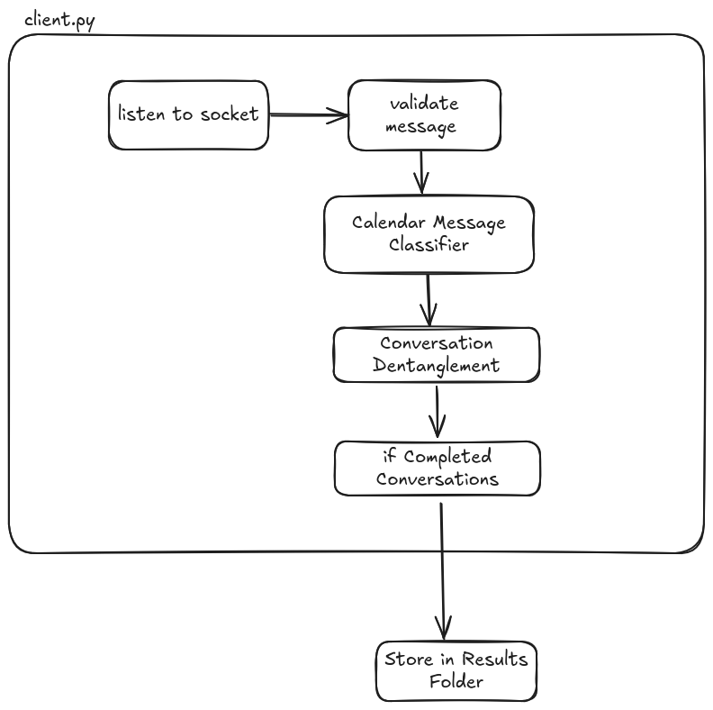
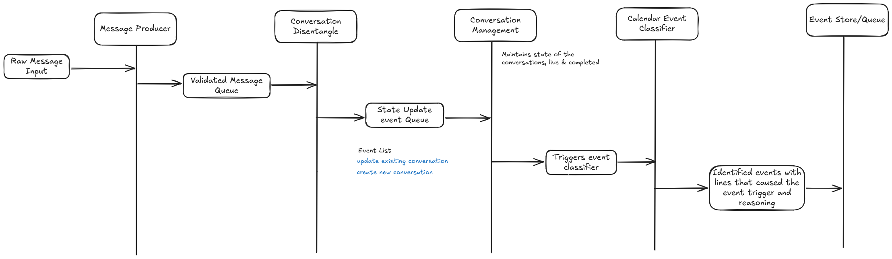

# Message Stream Classifier

A websocket client that processes messages from a socket and tries to dentable conversations and categorize them as possible calendar events

# High level Information flow

## Sync Flow [Deprecated in favour of Async client with last_six_message model for disentanglement]

## Async Flow

The Async flow uses qwq:32b llm running with ollama for the disentagling the stream of messages coming in before classification.

# Models

There are two problem statements for which we have models for,

## Message CLassifier
This is a bert model trained over synthetic data generated for classifying a group of messages to have an intent to get on a call or not.

The saynthetic data generation and the model creation code can be found under [notebooks folder](./notebooks/)

## Conversation Disentangelent

The process of converting a stream of messages into conversations is called conversation disentanglement

There are two models,

- [Rule Based model](./src/models/conversations/disentanglement/rule_based_classifier.py), this looks at embedding similarity, user mentions and timestamp differences
- [Last Six Message based model](./src/models/conversations/disentanglement/) this model is based on the assumption that you can solve this problem by just looking at the last 6 messages of the stream and classify the new incoming message as part of either of them or the new one

# Running With Docker [Sync Flow Only]

- setup `.env` file with `cp .env.example .env` and set the WS_SOCK variable, this is the websocket that gets ingested.
- setup docker if you don't have it yet
- run `sh build_and_run.sh`
    - **what it does**
        - creates model (this is where the model gets stored) and results (the output will be generated here) folder
        - it checks if you have the model files if not downloads them
        - run docker build 
        - run docker run command with the required attached volumes
        - execute the client.py in docker, this will start processing the stream

# Running with manual setup / seeting up for development
- setup the `.env` file with the WS_SOCK variable
- setup uv https://docs.astral.sh/uv/getting-started/installation/ 
- create `model/bert_classifier_v1` and `results` folder
- download the model files from
    - [config.json](https://message-stream-classifier.s3.ca-central-1.amazonaws.com/model/bert-classifier-v1/config.json)
    - [tensors](https://message-stream-classifier.s3.ca-central-1.amazonaws.com/model/bert-classifier-v1/model.safetensors)
    - [training_args](https://message-stream-classifier.s3.ca-central-1.amazonaws.com/model/bert-classifier-v1/training_args.bin)
- run `uv run ingest`

# running tests

- after setting up uv, you can run `uv run pytest`
